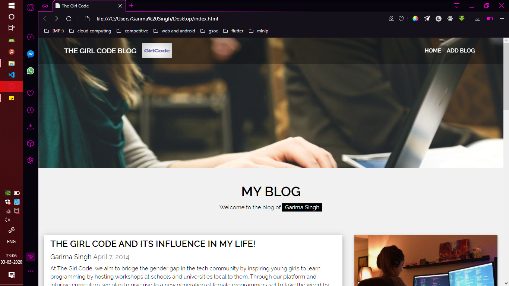

# The Girl Code Website Boilerplate 

## Task for #build 2020

At The Girl Code, we aim to bridge the gender gap in the tech community by inspiring young girls to learn programming by hosting workshops at schools and universities local to them. Through our platform and intuitive curriculum, we plan to give rise to a new generation of female programmers set to take the world by storm. 

This project is also meant to be a starting for all techies interested to get their hands dirty in open-source contributions. A highlight of this project being this project is "built by the community for the community".

